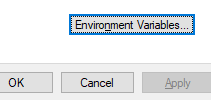
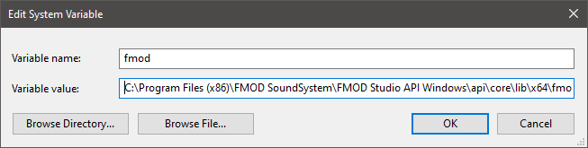

# Interactive Music Space Refactor

## Installation

Everything shown will be for windows. Mac and Linux will be similar

## FMOD Engine

Firstly, to run you'll need the FMOD Engine Library [here](https://www.fmod.com/download#fmodstudiosuite).

### FMOD For Windows Installation

Once you've insalled the engine you'll need to add it to your path.

- Serach for 'evnironment' in your search bar

- Click on 'Environment Varibales...'

- Hit 'New...' under System variables.

- In the variable name field type 'fmod'
- In the variable value field type the path to your fmod engine bin. 
  - Default value is `C:\Program Files (x86)\FMOD SoundSystem\FMOD Studio API Windows\api\core\lib\x64\fmod.dll`

#### The Unfun Part

As of the last update of this readme (August 11th, 2021) the pyfmodex library (ver. 0.7.0) is not working on the windows (or maybe it's just for me :C)

If you try to run this program and start running into errors regarding the fmod module not beign found, follow these steps:

- go to your pyfmodex installation
  - `venv\Lib\site-packages\pyfmodex\fmodex.py`
  - Replace line 6 `_dll = windll.fmod` with `_dll = WinDll(os.getenv('fmod'))`

I am activley looking to make a PR to the pyfmodex repo to get this fix in.

## Music

For each of the four folders in `Instrument Tracks` you should fill it with that number of sound files i.e. `Instrument Tracks\4` should have four sound files in it.

The sounds are loaded into quadrants top to bottom, left to right so order the files in a way that sorts them the way you want them to be loaded.

## Python

Start with your favorite virtual environment in your prefered CL

`virtualenv venv` 

Activate it 

`venv\Scripts\activate`

Then install the dependencies

`pip install -r requirements.txt`

Run IMS

`python main.py`

## Tips

- The better your lighting the better the results
  - if possible put the light near the camera
- Having a solid color, flat background for the inital image works wonders for accuracy

## Controls

| key  | action  |
|---|---|
| VISION CONTROLS | |
| Enter | quit program |
| d  | toggle all debug info |
| i | toggle quadrant on/off info |
| o | toggle On/Off text display |
| p | toggle quadrant comparison percentage |
| r | reset base image |
| 1 | set number of quadrants to 2|
| 2 | set number of quadrants to 4|
| 3 | set number of quadrants to 8|
| 4 | set number of quadrants to 16|
| SOUND CONTROLS | |
| = | Volume up |
| - | Volume down |
| Space | start playback |